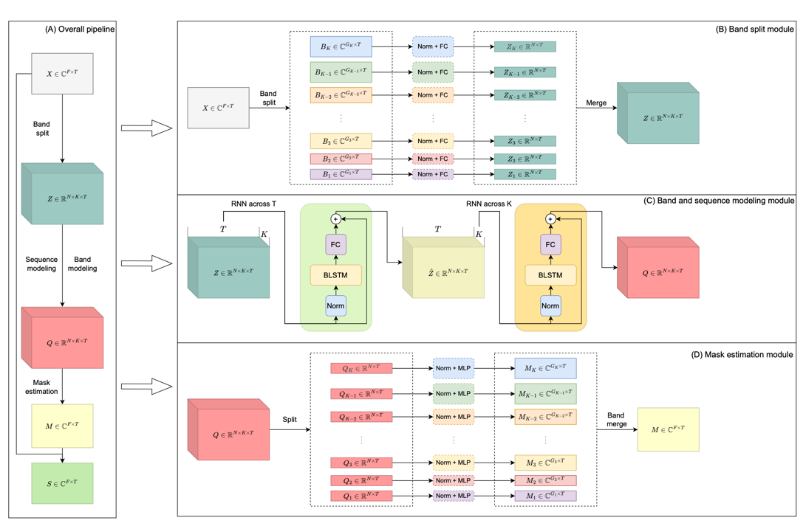

# BandSplitRNN Pytorch

Unofficial PyTorch implementation of the paper [Music Source Separation with Band-split RNN](https://arxiv.org/pdf/2209.15174.pdf).



---
## Table of Contents

1. [Changelog](#changelog)
1. [Dependencies](#dependencies)
2. [Inference](#inference)
3. [Train your model](#trainmodel)
   1. [Dataset preprocessing](#preprocessing)
   2. [Training](#train)
   3. [Evaluation](#eval)
4. [Repository structure](#structure)
5. [Citing](#cite)

---
<a name="changelog"/>

# Changelog


- **29.07.2023**
  - Made some updates to the code.
  - A big thanks to [unemployed-denizen](https://github.com/unemployed-denizen) for finding a bug in the code. 
  I've just uploaded the new checkpoint to the table with higher scores than before.

---
<a name="dependencies"/>

# Dependencies

Python version - **3.10**.  
To install dependencies, run:
```
pip install -r requirements.txt
```
Additionally, **ffmpeg** should be installed in the venv.  
If using ``conda`[example_vocals.mp3](..%2F..%2F..%2FDownloads%2Fexample_vocals.mp3)`, you can run:
```
conda install -c conda-forge ffmpeg
```
All scripts should be run from `src` directory.

`Train`/`evaluation`/`inference` pipelines support GPU acceleration. 
To activate it, specify the following `env` variable:
```
export CUDA_VISIBLE_DEVICES={DEVICE_NUM} 
```

---
<a name="inference"/>

## Inference

To run inference on your file(s), firstly, you need to download checkpoints.

Available checkpoints:

| Target                                                                                       | Epoch | uSDR (hop=0.5) | cSDR (hop=0.5) |
|----------------------------------------------------------------------------------------------|-------|----------------|----------------|
| [Vocals](https://drive.google.com/file/d/14FzOPUcf4BKym1kCRqRH1PeJWSvv4qHE/view?usp=sharing) | 139   | 6.883 +- 2.488 | 6.665 +- 2.717 |
| Bass                                                                                         | -     | -              | -              |
| Drums                                                                                        | -     | -              | -              |
| Other                                                                                        | -     | -              | -              |

After you download the `.pt` file, put it into `./saved_models/{TARGET}/` directory.

Afterwards, run the following script: 

```
python3 inference.py [-h] -i IN_PATH -o OUT_PATH [-t TARGET] [-c CKPT_PATH] [-d DEVICE]

options:
  -h, --help            show this help message and exit
  -i IN_PATH, --in-path IN_PATH
                        Path to the input directory/file with .wav/.mp3 extensions.
  -o OUT_PATH, --out-path OUT_PATH
                        Path to the output directory. Files will be saved in .wav format with sr=44100.
  -t TARGET, --target TARGET
                        Name of the target source to extract.
  -c CKPT_PATH, --ckpt-path CKPT_PATH
                        Path to model's checkpoint. If not specified, the .ckpt from SAVED_MODELS_DIR/{target} is used.
  -d DEVICE, --device DEVICE
                        Device name - either 'cuda', or 'cpu'.
```
You can customize inference via changing `audio_params` in `./saved_models/{TARGET}/hparams.yaml` file. Here is `vocals` example:
```
python3 inference.py -i ../example/example.mp3 -o ../example/ -t vocals
```

There is still some work going on with training better checkpoints, 
and at this moment I've trained only (pretty bad) vocals extraction model. 

---
<a name="trainmodel"/>

## Train your model

In this section, the model training pipeline is described.

---

<a name="preprocessing"/>

### Dataset preprocessing

The authors used the `MUSDB18-HQ` dataset to train an initial source separation model.
You can access it via [Zenodo](https://zenodo.org/record/3338373#.Y_jrMC96D5g).

After downloading, set the path to this dataset as an environmental variable 
(you'll need to specify it before running the `train` and `evaluation` pipelines):
```
export MUSDB_DIR={MUSDB_DIR}
```

To speed up the training process, instead of loading whole files, 
we can precompute the indices of fragments we need to extract. 
To select these indices, the proposed Source Activity Detection algorithm was used.

To read the `musdb18` dataset and extract salient fragments according to the `target` source, use the following script:
```
python3 prepare_dataset.py [-h] -i INPUT_DIR -o OUTPUT_DIR [--subset SUBSET] [--split SPLIT] [--sad_cfg SAD_CFG] [-t TARGET [TARGET ...]]

options:
  -h, --help            show this help message and exit
  -i INPUT_DIR, --input_dir INPUT_DIR
                        Path to directory with musdb18 dataset
  -o OUTPUT_DIR, --output_dir OUTPUT_DIR
                        Path to directory where output .txt file is saved
  --subset SUBSET       Train/test subset of the dataset to process
  --split SPLIT         Train/valid split of train dataset. Used if subset=train
  --sad_cfg SAD_CFG     Path to Source Activity Detection config file
  -t TARGET [TARGET ...], --target TARGET [TARGET ...]
                        Target source. SAD will save salient fragments of vocal audio.

```
Output is saved to `{OUTPUT_DIR}/{TARGET}_{SUBSET}.txt` file. The structure of the file is as follows:
```
{MUSDB18 TRACKNAME}\t{START_INDEX}\t{END_INDEX}\n
```

---
<a name="train"/>

### Training

To train the model, a combination of `PyTorch-Lightning` and `hydra` was used.
All configuration files are stored in the `src/conf` directory in `hydra`-friendly format.

To start training a model with given configurations, just use the following script:
```
python train.py
```
To configure the training process, follow `hydra` [instructions](https://hydra.cc/docs/advanced/override_grammar/basic/).
By default, the model is trained to extract `vocals`. To train a model to extract other sources, use the following scripts:
```
python train.py train_dataset.target=bass model=bandsplitrnnbass
python train.py train_dataset.target=drums model=bandsplitrnndrums
python train.py train_dataset.target=other
```

After training is started, the logging folder will be created for a particular experiment with the following path:
```
src/logs/bandsplitrnn/${now:%Y-%m-%d}_${now:%H-%M}/
```
This folder will have the following structure:
```
├── tb_logs
│   └── tensorboard_log_file    - main tensorboard log file 
├── weights
│   └── *.ckpt                  - lightning model checkpoint files.
└── hydra
│   └──config.yaml              - hydra configuration and override files 
└── train.log                   - logging file for train.py
   
```

---
<a name="eval"/>

### Evaluation

To start evaluating a model with given configurations, use the following script:

```
python3 evaluate.py [-h] -d RUN_DIR [--device DEVICE]

options:
  -h, --help            show this help message and exit
  -d RUN_DIR, --run-dir RUN_DIR
                        Path to directory checkpoints, configs, etc
  --device DEVICE       Device name - either 'cuda', or 'cpu'.
```

This script creates `test.log` in the `RUN_DIR` directory and writes the `uSDR` and `cSDR` metrics there 
for the test subset of the MUSDB18 dataset.


---
<a name="structure"/>

## Repository structure
The structure of this repository is as following:
```
├── src
│   ├── conf                        - hydra configuration files
│   │   └── **/*.yaml               
│   ├── data                        - directory with data processing modules
│   │   └── *.py
│   ├── files                       - output files from prepare_dataset.py script
│   │   └── *.txt
│   ├── model                       - directory with modules of the model 
│   │   ├── modules
│   │   │   └── *.py
│   │   ├── __init__.py
│   │   ├── bandsplitrnn.py         - file with the model itself
│   │   └── pl_model.py             - file with Pytorch-Lightning Module for training and validation pipeline
│   ├── utils                       - directory with utilities for evaluation and inference pipelines
│   │   └── *.py                    
│   ├── evaluate.py                 - script for evaluation pipeline 
│   ├── inference.py                - script for inference pipeline
│   ├── prepare_dataset.py          - script for dataset preprocessing pipeline
│   ├── separator.py                - separator class, which is used in evaluation and inference pipelines
│   └── train.py                    - script for training pipeline
├── example                         - test example for inference.py
│   └── *.wav
├── .gitignore
├── README.md 
└── requirement.txt
```

---
<a name="cite"/>

## Citing

To cite this paper, please use:
```
@misc{https://doi.org/10.48550/arxiv.2209.15174,
  doi = {10.48550/ARXIV.2209.15174},
  url = {https://arxiv.org/abs/2209.15174},
  author = {Luo, Yi and Yu, Jianwei},
  keywords = {Audio and Speech Processing (eess.AS), Machine Learning (cs.LG), Sound (cs.SD), Signal Processing (eess.SP), FOS: Electrical engineering, electronic engineering, information engineering, FOS: Electrical engineering, electronic engineering, information engineering, FOS: Computer and information sciences, FOS: Computer and information sciences},
  title = {Music Source Separation with Band-split RNN},
  publisher = {arXiv},
  year = {2022},
  copyright = {Creative Commons Attribution Non Commercial Share Alike 4.0 International}
}
```
